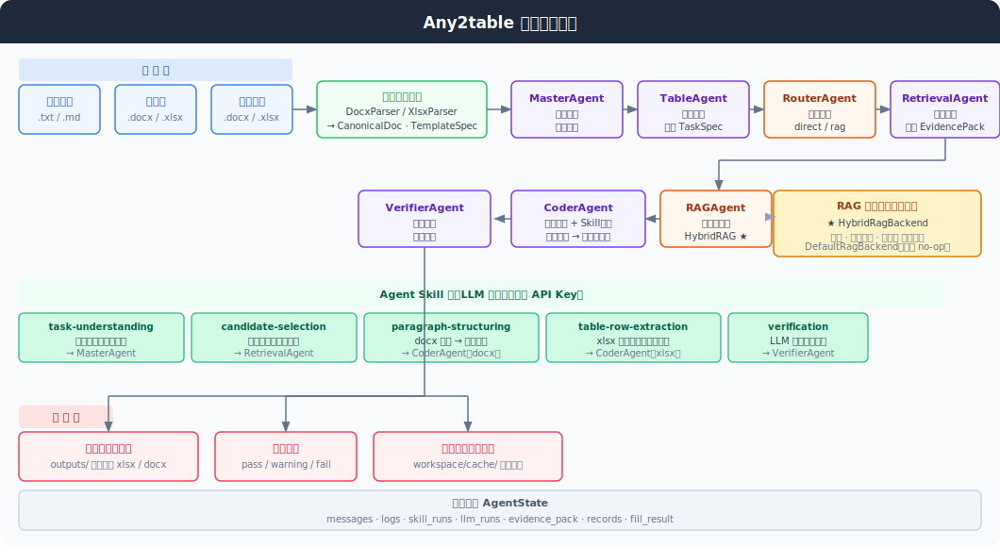

# Any2table

Any2table 是一个面向"多源文档到目标表格自动填写"的核心 AI 模块。它提供稳定的确定性主链，同时接入了多智能体编排、Agent Skill 和 RAG 扩展接口，方便后续继续增强语义能力和多智能体协作。

## 架构图



## 1. 项目概览

Any2table 的核心定位：
- 先用稳定的解析、抽取、候选融合、写回链路跑通任务
- 再用多智能体架构把流程组织起来
- 通过 Agent Skill 和 RAG backend 为创新能力留接口

支持的输入与输出形态：
- 输入侧：`txt / md / docx / xlsx`
- 输出侧：`docx / xlsx` 模板写回，输出文件位于模板文件同级的 `outputs/` 目录

## 2. 多智能体架构

主流程为 7 个 Agent 串联：

```text
MasterAgent → TableAgent → RouterAgent → RetrievalAgent → RAGAgent → CoderAgent → VerifierAgent
```

| Agent | 职责 | 状态 |
|---|---|---|
| `MasterAgent` | 检查输入、生成执行路线、记录全局轨迹 | 已启用 |
| `TableAgent` | 解析模板文档与用户要求，生成 `TemplateSpec / TaskSpec` | 已启用 |
| `RouterAgent` | 基于 source doc 数量、约束数量、字段数量动态决定路由 | 已启用，动态路由 |
| `RetrievalAgent` | 组织 `EvidencePack`，收集规则证据，构建检索单元 | 已启用 |
| `RAGAgent` | 根据 route 调用 RAG backend 做证据增强 | 已启用 |
| `CoderAgent` | 生成候选记录、合并候选、生成结构化记录 | 已启用 |
| `VerifierAgent` | 写回模板并生成校验结果 | 已启用 |

所有 Agent 共享一个统一的 `AgentState`，包含：
- 原始文档与解析结果
- `TemplateSpec / TaskSpec / EvidencePack`
- `selected_route / router_decision / rag_result`
- `rule_candidates / agent_candidates / merged_candidates`
- `records / fill_result / verification_report`
- `messages / logs / skill_runs / skill_results / llm_runs`

### RouterAgent 动态路由规则

RouterAgent 在 RetrievalAgent 之前运行，基于以下规则决定是否走 RAG：

| 规则 | 触发条件 |
|---|---|
| Rule 1 | source 文档 ≥ 3 个（多源歧义） |
| Rule 2 | 任务约束 ≥ 2 个（选择性任务） |
| Rule 3 | 目标字段 ≥ 5 个（复杂 schema） |
| Rule 4 | 字段覆盖率 < 50%（可选，仅 evidence 已有时） |

> 注意：RAG 默认已启用（`rag_backend = "hybrid"`）。若需关闭，传参 `--rag-backend default` 或在 `AppConfig` 中修改。

## 3. Agent Skill

Skill 定义位于：`src/any2table/skills/definitions/`

| Skill | 挂接 Agent | 作用 |
|---|---|---|
| `any2table-task-understanding` | `MasterAgent` | 从用户要求中提取任务意图与约束 |
| `any2table-candidate-selection` | `RetrievalAgent` | 对召回证据做建议性二次筛选 |
| `any2table-paragraph-structuring` | `CoderAgent` | 将 docx 段落转成结构化候选记录 |
| `any2table-table-row-extraction` | `CoderAgent` | 将 xlsx 表格数据语义映射到目标字段（支持近义列名） |
| `any2table-verification` | `VerifierAgent` | 对最终结果做 LLM review |

`CoderAgent` 按文档类型自动分发：docx（有段落块）→ `paragraph-structuring`；xlsx（仅有表格）→ `table-row-extraction`。

Skill 定位：
- 已可挂接并执行，记录 `skill_runs / skill_results / llm_runs`
- 默认确定性主链保底，Skill / LLM 路径负责增强
- 需配置 API Key 后才会实际调用 LLM

## 4. RAG 状态

| Backend | 作用 | 状态 |
|---|---|---|
| `DefaultRagBackend` | no-op 占位，证据直接透传 | 可用，`--rag-backend default` 切换 |
| `HybridRagBackend` | 全量捞取 + schema-grounded 重排序，按词法匹配、字段覆盖、元数据三路打分 | **默认启用** |

检索原理：`RuleRetriever` 全量扫描所有源文档生成 `EvidencePack`，`HybridRagBackend` 再对证据按相关性排序，最相关的证据优先进入提取阶段。当前不依赖外部向量数据库，适合中小规模文档（数十页以内）。

## 5. 安装

```bash
# 建议 Python 3.11
cd ai_core
pip install -e .

# 可选：增强解析和 docx 写回
pip install python-docx docling

# 或使用 conda
conda create -n any2table python=3.11 -y
conda activate any2table
pip install -e .
pip install python-docx docling
```

## 6. CLI 使用

### 查看文件识别结果

```bash
python -m any2table.cli inspect --path "./test_data/mini"
```

### 顺序模式（默认）

```bash
python -m any2table.cli run --path "./test_data/mini"
```

### 多智能体模式

```bash
python -m any2table.cli run --path "./test_data/mini" --agent-runtime --agent-runtime-backend langgraph
```

### 关闭 RAG（RAG 默认已开启）

```bash
python -m any2table.cli run --path "./test_data/mini" --agent-runtime --rag-backend default
```

### 导出中间产物（调试）

```bash
python -m any2table.cli run --path "./test_data/mini" --agent-runtime --dump-intermediate
```

### 启用 LLM Skill

```bash
export OPENAI_API_KEY="你的APIKey"

python -m any2table.cli run --path "./test_data/mini" \
  --agent-runtime \
  --enable-llm-skills \
  --llm-model gpt-4o-mini \
  --llm-base-url "你的OpenAI兼容BaseURL"
```

## 7. 输出位置

- 写回文件：模板文件所在目录下的 `outputs/` 子目录
- 中间产物：默认写到 `workspace/cache/`

例如，模板在 `test_data/mini/模板.xlsx`，输出在 `test_data/mini/outputs/模板-filled.xlsx`。

## 8. 工作区文件命名约定

CLI 自动按文件名分类：

| 关键词 | 分类 |
|---|---|
| 文件名含 `模板` 或 `template` | `template` 角色 |
| 文件名含 `用户要求` | `user_request` 角色 |
| 其他 | `source` 角色 |

## 9. 测试

```bash
cd ai_core
python -m unittest discover -s tests -v
```

共 11 个单元测试，覆盖候选合并、RAG backend、行解析与日期策略。

## 10. 项目结构

```
ai_core/
├── engine/                  # FastAPI 接入层（供 main.py 调用）
│   ├── engine.py            # handle_module_3_fusion 等入口函数
│   └── schemas.py
├── src/any2table/
│   ├── agents.py            # 7 个 Agent 实现
│   ├── app.py               # build_registry / build_orchestrator
│   ├── config.py            # AppConfig
│   ├── parsers.py           # DocxParser / XlsxParser / TextParser / DoclingSourceParser
│   ├── analyzers.py         # TemplateAnalyzer
│   ├── planners.py          # TaskPlanner
│   ├── retrievers.py        # RuleRetriever
│   ├── extractors.py        # 通用规则提取（模糊列名匹配 + KV段落提取）
│   ├── rag.py               # DefaultRagBackend / HybridRagBackend
│   ├── writers.py           # XlsxWriter / DocxTableWriter
│   ├── verifiers.py         # DefaultVerifier
│   ├── compute.py           # PythonComputeEngine
│   ├── registry.py          # ComponentRegistry
│   ├── candidates/          # CandidateRecord 与构建逻辑
│   ├── merging/             # 候选合并器
│   ├── indexing/            # 检索单元构建
│   ├── core/
│   │   ├── models.py        # 全部领域模型
│   │   ├── protocols.py     # 组件接口协议
│   │   ├── runtime.py       # AgentState / GraphRuntime / LangGraphRuntime
│   │   └── orchestrator.py  # SequentialOrchestrator / MultiAgentOrchestrator
│   ├── skills/
│   │   ├── definitions/     # 5 个 Skill 定义（SKILL.md）
│   │   ├── loader.py
│   │   ├── registry.py
│   │   ├── renderer.py
│   │   └── executor.py
│   └── llm/                 # OpenAI-compatible LLM client
└── tests/
    ├── test_candidate_merger.py
    ├── test_hybrid_rag.py
    └── test_row_resolution.py
```
