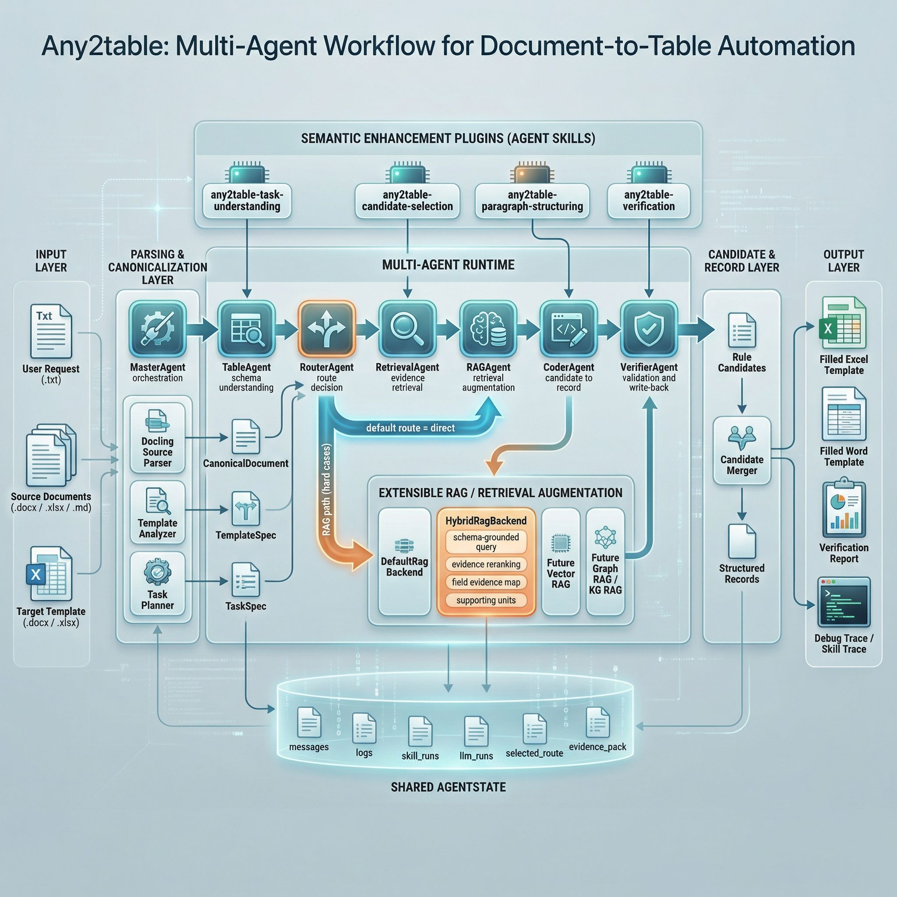

# Any2table

Any2table 是一个面向“多源文档到目标表格自动填写”的项目。当前版本已经跑通了面向比赛场景的第一版系统：既保留了稳定的确定性主链，也接入了多智能体编排、Agent Skill 和 RAG 扩展接口，方便后续继续增强语义能力、多智能体协作和图检索能力。

## 架构图




## 1. 当前项目概览

当前 Any2table 的核心定位是：
- 先用稳定的解析、抽取、候选融合、写回链路跑通任务
- 再用多智能体架构把流程组织起来
- 再通过 Agent Skill 和 RAG backend 为后续比赛版创新能力留接口

目前已经支持的输入与输出形态：
- 输入侧：`txt / md / docx / xlsx`
- 输出侧：`docx / xlsx` 模板写回

当前仓库中已经包含：
- 第一版可运行的文档到表格填充流程
- 多智能体运行时与 LangGraph 编排入口
- 本地 Agent Skill 注册、渲染、执行与追踪机制
- 第一版 RouterAgent 与 RAGAgent 
- 第一版 `HybridRagBackend`
- 三组测试数据与基础单测

## 2. 当前多智能体架构

当前主流程已经升级为 7 个 Agent 串联的架构：

```text
MasterAgent
    -> TableAgent
    -> RouterAgent
    -> RetrievalAgent
    -> RAGAgent
    -> CoderAgent
    -> VerifierAgent
```

各 Agent 的职责如下：

| Agent | 当前职责 | 当前状态 |
|---|---|---|
| `MasterAgent` | 检查输入、生成执行路线、记录全局轨迹 | 已启用 |
| `TableAgent` | 解析模板文档与用户要求，生成 `TemplateSpec / TaskSpec` | 已启用 |
| `RouterAgent` | 决定当前任务走 `direct` 还是未来的 `rag` 路径 | 已启用，但当前固定 `direct` |
| `RetrievalAgent` | 组织 `EvidencePack`，收集规则证据 | 已启用 |
| `RAGAgent` | 根据 route 调用 RAG backend 做证据增强 | 已启用，但默认不改变现有流程 |
| `CoderAgent` | 生成候选记录、合并候选、生成结构化记录 | 当前最接近核心业务 agent |
| `VerifierAgent` | 写回模板并生成校验结果 | 已启用 |

当前系统共享一个统一的 `AgentState`，其中包含：
- 原始文档与解析结果
- `TemplateSpec`
- `TaskSpec`
- `EvidencePack`
- `selected_route / router_decision / rag_result`
- `rule_candidates / agent_candidates / merged_candidates`
- `records / fill_result / verification_report`
- `messages / logs / skill_runs / skill_results / llm_runs`

这意味着当前系统已经不仅仅是“顺序脚本”，而是一个有共享状态、轨迹记录和扩展接口的多智能体工作流。

## 3. 当前 Agent Skill 设计

当前项目已经接入本地 Skill Runtime，技能定义位于：
- [`.claude/skills`](/d:/Any2table/.claude/skills)

当前已有 4 个最小 Skill：

| Skill | 挂接 Agent | 作用 | 当前地位 |
|---|---|---|---|
| `any2table-task-understanding` | `MasterAgent` | 从用户要求中提取任务意图与约束 | 规划增强层 |
| `any2table-candidate-selection` | `RetrievalAgent` | 对召回证据做建议性二次筛选 | 检索建议层 |
| `any2table-paragraph-structuring` | `CoderAgent` | 将 docx 段落转成结构化候选记录 | 抽取增强层 |
| `any2table-verification` | `VerifierAgent` | 对最终结果做 LLM review | 校验增强层 |

当前 Skill 的定位是：
- 已经可以挂接并执行
- 已经可以记录 `skill_runs / skill_results / llm_runs`
- 但默认仍以底层确定性模块保证稳定结果

也就是说，当前系统是：
- 确定性主链保底
- Skill / LLM 路径负责增强
- 后续可以逐步把更复杂的语义决策接到 Agent 上

## 4. 当前 RAG 状态

为了后续比赛场景中的创新性表达，当前项目已经加入了 Router 和 RAG 的第一阶段架构，但默认不影响现有结果。

### 当前设计
- `RouterAgent` 已接入主链
- 当前 `RouterAgent` 固定输出 `route = direct`
- `RAGAgent` 已接入主链
- 当前 RAG 是否真正生效，取决于 route

### 当前已注册的 RAG backend

| Backend | 作用 | 当前状态 |
|---|---|---|
| `DefaultRagBackend` | no-op，占位 backend | 默认 backend |
| `HybridRagBackend` | 第一版 schema-grounded hybrid RAG | 已实现，但默认不进入主流程 |

### HybridRagBackend 当前做什么
- 根据 `TaskSpec + TemplateSpec` 构造查询摘要
- 从模板字段、约束、任务文本中提取 query terms
- 对 `EvidencePack` 中的证据做 schema-aware 重排
- 输出 `selected_unit_ids / supporting_units / field_evidence_map / query_summary`

当前策略是：
- 先把 RAG 架构和 backend 接进去
- 但默认仍然维持 `direct` 路径
- 等遇到更难的数据集时，再升级 Router 策略

## 5. 当前处理流程

整体处理流程可以概括为：

1. 读取任务目录，自动识别模板、用户要求和 source 文档
2. 解析输入文档，转换为统一的 `CanonicalDocument`
3. 分析模板，生成 `TemplateSpec`
4. 解析用户要求，生成 `TaskSpec`
5. 进入多智能体运行时，按顺序执行各 Agent
6. 检索证据，形成 `EvidencePack`
7. 将证据转换为候选记录，并合并为最终 `StructuredRecord`
8. 写回 `docx / xlsx` 模板
9. 输出 `verification_report` 和调试信息

当前稳定业务结果主要仍来自这些底层模块：
- `parsers.py`
- `analyzers.py`
- `planners.py`
- `retrievers.py`
- `extractors.py`
- `candidates`
- `merging`
- `writers.py`

## 6. 安装方式

### 6.1 Python 版本
建议使用：
- `Python 3.11`

### 6.2 基础安装

先在项目根目录安装本项目：

```powershell
pip install -e .
```

### 6.3 推荐补充依赖

为了完整跑通当前样例，建议额外安装：

```powershell
pip install python-docx
pip install docling
```

说明：
- `openpyxl` 已在项目依赖中声明
- `python-docx` 用于 `docx` 模板写回
- `docling` 用于 source 文档侧的 Docling 解析器

如果你使用 conda，也可以先创建环境后再安装，例如：

```powershell
conda create -n any2table python=3.11 -y
conda activate any2table
pip install -e .
pip install python-docx
pip install docling
```

## 7. 如何运行

### 7.1 查看目录中的任务文件识别结果

```powershell
python -m any2table.cli inspect --path ".\test_data\COVID-19数据集"
```

这个命令会输出当前目录下文件被识别成：
- `template`
- `user_request`
- `source`

### 7.2 运行默认主流程

```powershell
python -m any2table.cli run --path ".\test_data\COVID-19数据集"
```

这会执行当前默认流程，并输出 JSON 结果。

### 7.3 运行多智能体版本

```powershell
python -m any2table.cli run --path ".\test_data\COVID-19数据集" --agent-runtime --agent-runtime-backend langgraph
```

说明：
- `--agent-runtime` 表示启用多智能体运行时
- `--agent-runtime-backend langgraph` 表示使用 LangGraph 编排

### 7.4 运行并导出中间结果

```powershell
python -m any2table.cli run --path ".\test_data\COVID-19数据集" --agent-runtime --agent-runtime-backend langgraph --dump-intermediate > .\outputs\covid-run.json
```

这适合调试：
- 最终 JSON 输出
- 中间 canonical / retrieval / schema 结果
- route / skill / llm / rag 调试信息

### 7.5 显式选择 RAG backend

```powershell
python -m any2table.cli run --path ".\test_data\COVID-19数据集" --agent-runtime --agent-runtime-backend langgraph --rag-backend hybrid
```

注意：
- 即使这里指定 `--rag-backend hybrid`
- 只要 `RouterAgent` 仍然固定 `direct`
- 当前主流程结果就不会被 RAG 改写

## 8. 如何启用 LLM Skill

如果要启用基于 API 的 Skill 执行，需要先配置 API Key 和 Base URL。

例如在 PowerShell 中：

```powershell
$env:OPENAI_API_KEY="你的APIKey"
```

然后执行：

```powershell
python -m any2table.cli run --path ".\test_data\COVID-19数据集" --agent-runtime --agent-runtime-backend langgraph --enable-llm-skills --llm-model gpt-4o-mini --llm-base-url "你的OpenAI兼容BaseURL"
```

说明：
- `--enable-llm-skills` 会启用 Skill 的 LLM 执行
- 当前模型名可通过 `--llm-model` 指定
- 当前 API Key 环境变量默认读取 `OPENAI_API_KEY`
- 如果你使用别的环境变量名，可以用 `--llm-api-key-env` 指定

## 9. 输出位置

运行成功后，输出通常在以下位置：
- 模板写回文件：`outputs/`
- 调试 JSON：由你重定向到目标文件，例如 `outputs/covid-run.json`
- 中间产物：默认写到 `workspace/cache/`

例如：
- `outputs/COVID-19 模板-filled.xlsx`
- `outputs/2025山东省环境空气质量监测数据信息-模板-filled.docx`

## 10. 当前项目状态

当前项目已经完成的内容包括：
- 基础文档解析与模板写回流程
- `CandidateRecord / merger` 中间层
- 多智能体主链路
- LangGraph 运行时接入
- 4 个最小 Agent Skill
- RouterAgent 与 RAGAgent 抽象层
- 第一版 `HybridRagBackend`
- 三组样例数据的稳定跑通

当前还属于第一阶段的部分包括：
- `RouterAgent` 还没有做真正动态路由
- RAG 还没有默认介入主链
- Skill 还没有全面接管业务决策
- 还没有更重型的多智能体协作、judge、graph RAG 和 KG 推理


## 12. 总结

当前 Any2table 已经具备：
- 稳定的文档到表格自动填写主链
- 清晰的多智能体编排结构
- 可插拔的 Agent Skill 机制
- 已接入但默认关闭的 Router + RAG 扩展层